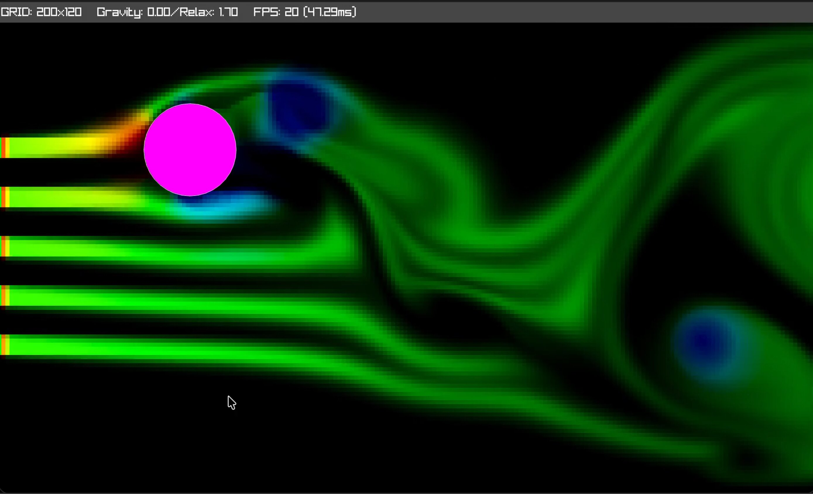
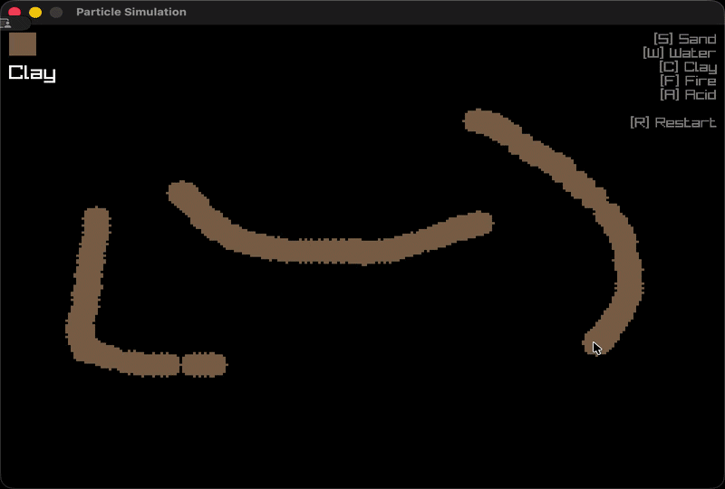
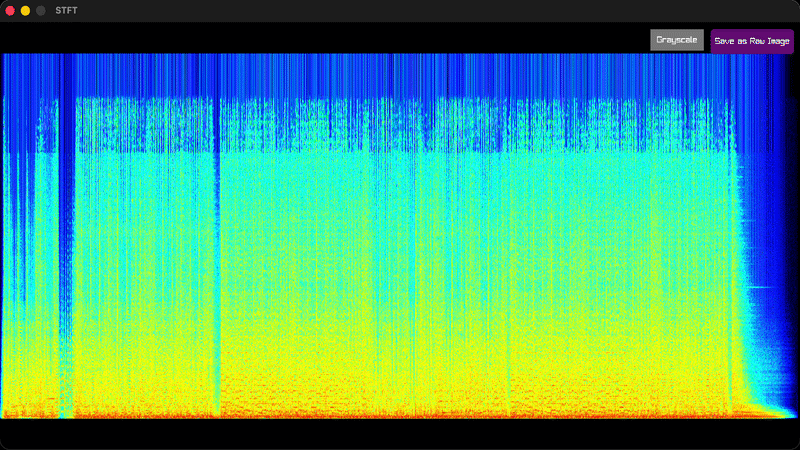
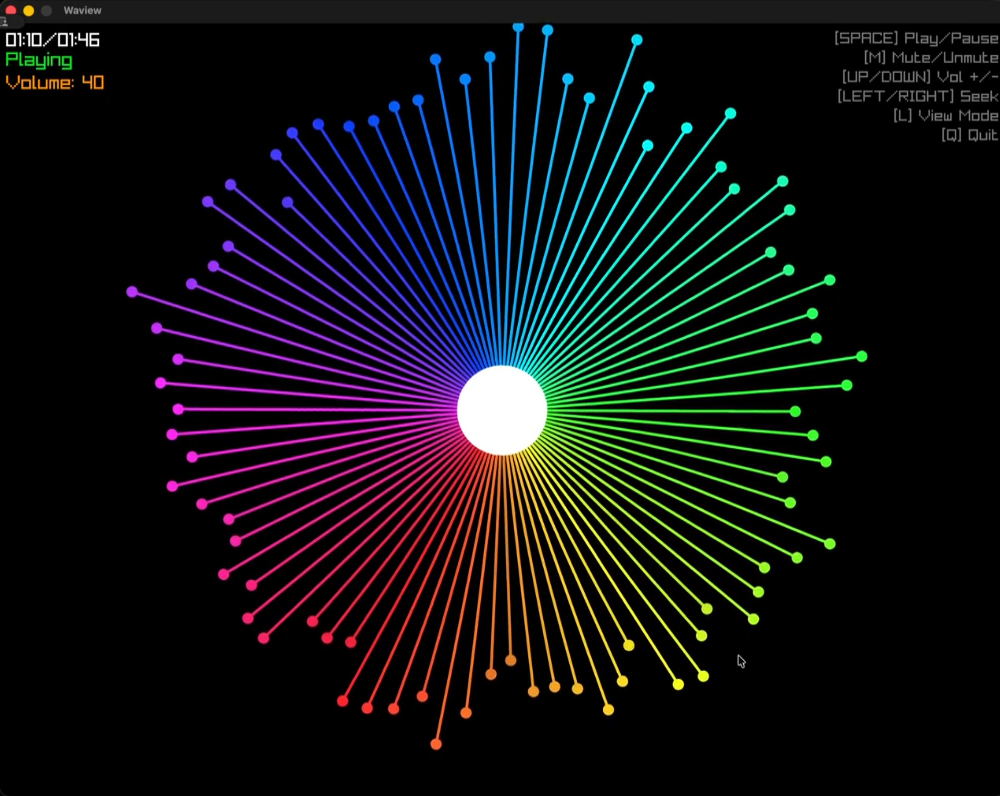
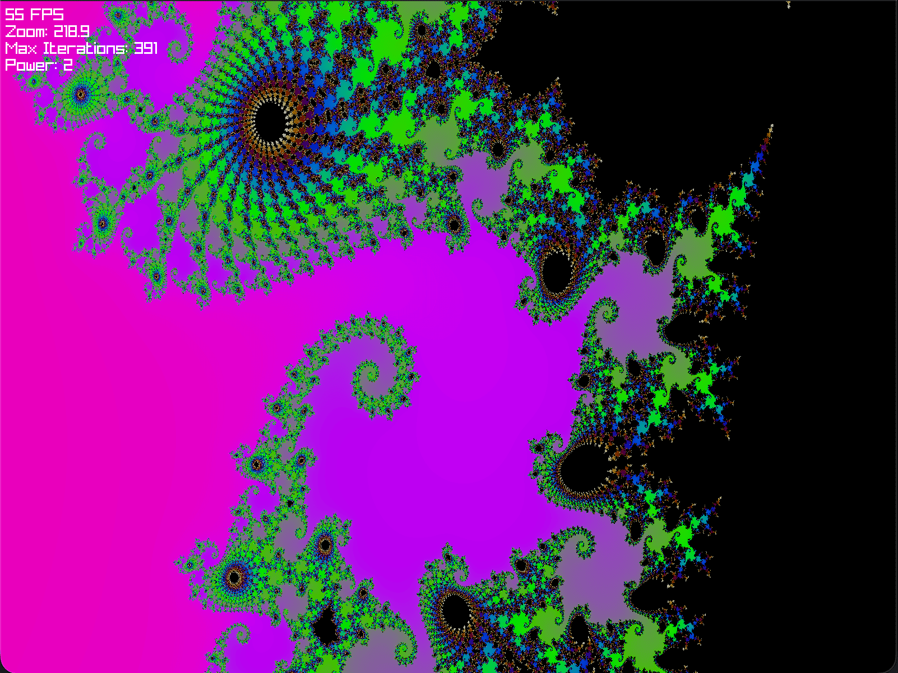

### Hello there 👋

**I am Ahmed, a Software Engineer and backend enthusiast located in Austria**.

### Projects I am proud of

The following projects are 100% open source.

#### Systems and Graphics

- [micro_market](https://github.com/AhmedAbouelkher/micro_market) Micro Market is a small microservices demo built around checkout, inventory, and invoice workflows. It mixes Go and C services, with `invoice-service` using SQLite, Redis, PDF generation, and OpenTelemetry logs in C
- [Mandelbrot_Fractal_Renderer](https://github.com/AhmedAbouelkher/Mandelbrot_Fractal_Renderer): This project explores classic complex-plane fractals: Mandelbrot set, Julia set, and Newton fractal.
- [fluid_simulation](https://github.com/AhmedAbouelkher/fluid_simulation): A passion project implementing an Eulerian fluid solver in C, inspired by my studies in physics and computer science.
- [go-particle_simulation](https://github.com/AhmedAbouelkher/go-particle_simulation): A cellular automaton-based particle simulation built with Go and Raylib, inspired by the falling sand genre and the technical design of Noita.
- [waview](https://github.com/AhmedAbouelkher/waview): A simple audio visualizer built with C and Raylib.
- [c_spectrogram](https://github.com/AhmedAbouelkher/c_spectrogram): A high-performance STFT spectrogram visualizer in C. Features a custom radix-2 FFT implementation, Hamming windowing, and real-time rendering using Raylib.
- [go-fft-raylib-impl](https://github.com/AhmedAbouelkher/go-fft-raylib-impl): A high-performance implementation of the 2D Fast Fourier Transform (FFT) using the Cooley-Tukey algorithm. This tool enables frequency-domain analysis and manipulation of images.
- [ffmpeg_ply](https://github.com/AhmedAbouelkher/ffmpeg_ply): A very simple implementation of [ffplay](https://ffmpeg.org/ffplay.html) written in C and using FFmpeg & [SDL](https://libsdl.org/).
- [go-hls-dash-video-processor](https://github.com/AhmedAbouelkher/go-hls-dash-video-processor): A Go-based video processing service that transcodes videos into adaptive bitrate streaming formats (HLS and MPEG-DASH) using FFmpeg.

#### Backend and Tools

- [yt_captions_download](https://github.com/AhmedAbouelkher/yt_captions_download): A Go tool to download and convert YouTube captions/subtitles into multiple formats.
- [omailer](https://github.com/AhmedAbouelkher/omailer): A minimal Go library for sending HTML emails over SMTP with built-in inline styling.
- [hls_downloader](https://github.com/AhmedAbouelkher/hls_downloader): A robust HLS (HTTP Live Streaming) downloader written in Go.
- [spock-websocket](https://github.com/AhmedAbouelkher/spock-websocket): A simple WebSocket server for real-time messaging with web and mobile clients.
- [VTT-Untertitle-parser](https://github.com/AhmedAbouelkher/VTT-Untertitle-parser): A handy tool to parse the untertitles of the movies and series that I watch and translate them to English or any other language of your choice.
- [ocpp-emulator-go](https://github.com/AhmedAbouelkher/ocpp-emulator-go): A dummy OCPP 1.6 charging point implementation for testing central systems.
- [hack_vm_translator](https://github.com/AhmedAbouelkher/hack_vm_translator): A VM translator for Nand2Tetris that converts stack-based VM code to Hack assembly language.
- [hack_assembler_go](https://github.com/AhmedAbouelkher/hack_assembler_go): A Go implementation of a Hack assembler for the Nand2Tetris Project 6.

#### Mobile Development

- [clean_flutter_build](https://github.com/AhmedAbouelkher/clean_flutter_build): Clean Flutter apps and reduce their code size to free up disk space.
- [gr_zoom](https://github.com/AhmedAbouelkher/gr_zoom): A Flutter plugin for the Zoom Client SDK.
- [security_tester](https://github.com/AhmedAbouelkher/security_tester): Flutter library to detect suspicious apps and abnormal environments.
- [flutter_socket_io_chat](https://github.com/AhmedAbouelkher/flutter_socket_io_chat): This app is just a demo app to teach the idea and the tools to use to create a simple Socket.IO chat.
- [groceries-shopping-flutter-app](https://github.com/AhmedAbouelkher/groceries-shopping-flutter-app): This project is a simple implementation for an existing, amazing, and exciting UI/UX design.

| [Fluid Simulation](https://github.com/AhmedAbouelkher/fluid_simulation) | [Particle Simulation](https://github.com/AhmedAbouelkher/go-particle_simulation) | [Spectrogram](https://github.com/AhmedAbouelkher/c_spectrogram) |
| :---------------------------------------------------------------------: | :-------------------------------------------------------------------------------: | :-------------------------------------------------------------: |
|  |  |  |
| [Waview](https://github.com/AhmedAbouelkher/waview) | [Mandelbrot Fractal Renderer](https://github.com/AhmedAbouelkher/Mandelbrot_Fractal_Renderer) |  |
|  |  |  |

### Projects I was a small part of

- _**open source**_ [stats](https://github.com/exelban/stats): Added the Arabic localization to the macOS application.
- _**open source**_ [media_kit](https://github.com/media-kit/media-kit):
  - A cross-platform video player & audio player for Flutter & Dart. Built/Improved native video players on android and ios for Flutter use.
  - Contributed to the best flutter video player source code _(in my opinion)_.
- Multiple educational platforms (LMS _Learning Management Systems_) for several clients.
  - Most noticeable apps were [Elqima](https://apps.apple.com/kz/app/%D9%85%D9%86%D8%B5%D8%A9-%D8%A7%D9%84%D9%82%D9%85%D8%A9-%D8%A7%D9%84%D8%A7%D9%84%D9%83%D8%AA%D8%B1%D9%88%D9%86%D9%8A%D8%A9/id1643443516), [Kain](https://apps.apple.com/kz/app/%D9%83%D9%8A%D8%A7%D9%86-%D8%A7%D9%84%D8%A7%D9%88%D8%A7%D8%A6%D9%84/id1589952965), [Edumate](https://apps.apple.com/us/app/edumate/id6443520187), [Science gate](https://apps.apple.com/kz/app/%D8%A7%D9%84%D8%AA%D9%81%D9%88%D9%82-%D9%84%D9%84%D8%AB%D8%A7%D9%86%D9%88%D9%8A%D8%A9-%D8%A7%D9%84%D8%B9%D8%A9/id1616002892), and many more...
- [El-Captain Fitness app](https://play.google.com/store/apps/details?id=io.fitness.club&hl=en): A fitness tracking app with more than 100k downloads and 4.5 stars rating.

### My Stack/Tools

#### Actively Using right now

C, Java, Go, JavaScript, TypeScript, Bash, Postgres, Redis, Docker, FFmpeg, macOS, Linux, Prometheus, Grafana, AWS, DigitalOcean, Google, and Nginx.

##### Used in the past

Swift, Dart, Kotlin, Objective, MongoDB, MariaDB, Mosquitto, Jira, and Firebase.

_When I remember more, I will update the list_ 😃

### Connect With Me

Follow/Connect [on LinkedIn](https://www.linkedin.com/in/ahmedmabouelkheir/) or Message me via e-mail ahmedabouelkher1(at)gmail(dot)com.
