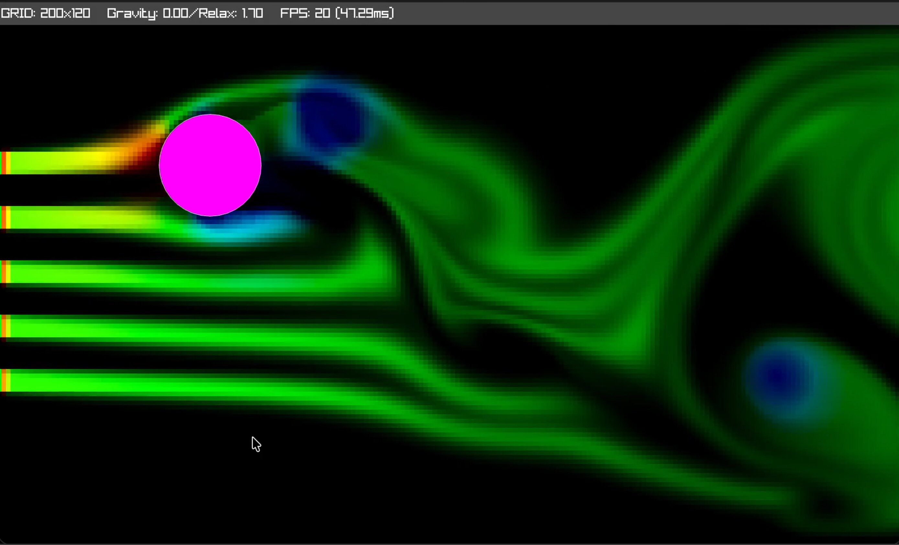
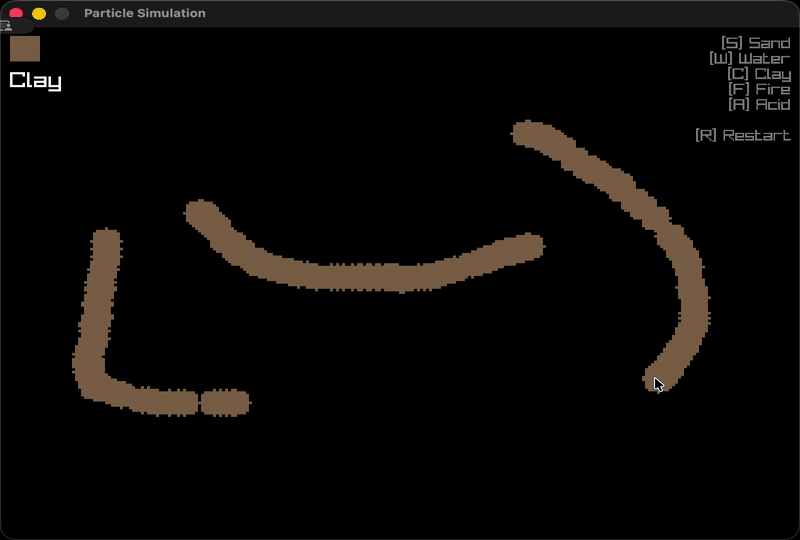
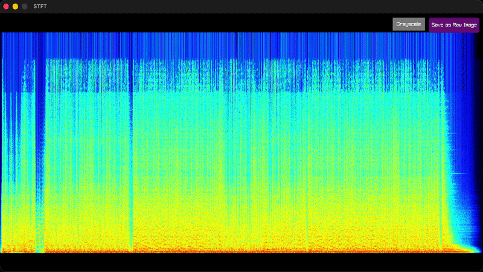
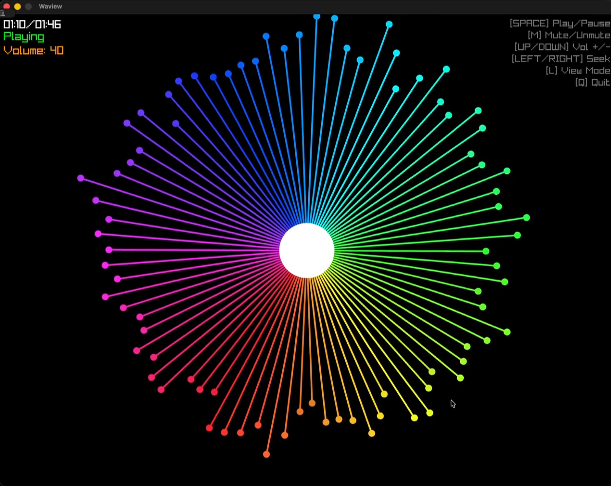
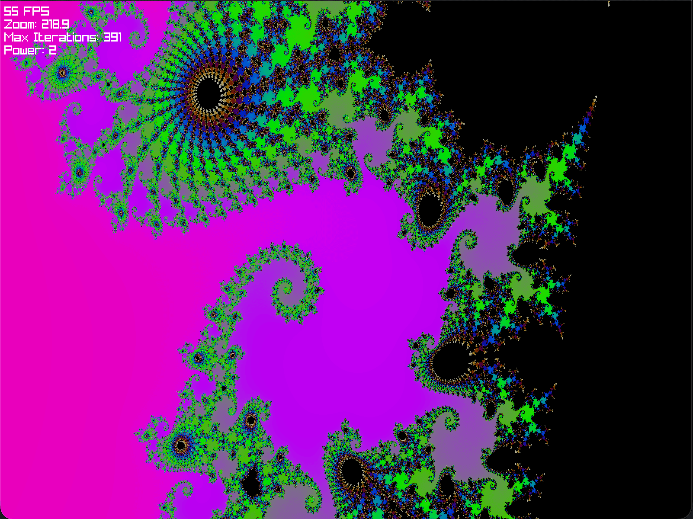
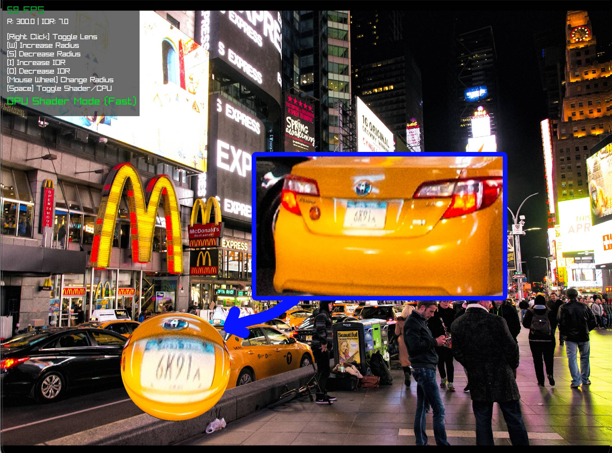

### Hello there 👋

**I am Ahmed, a Software Engineer and an Electrical Engineering master student located in Austria**.

### Projects I am proud of

The following projects are 100% open source.

#### Systems and Graphics

- [c-hls-dash-video-processor](https://github.com/AhmedAbouelkher/c-hls-dash-video-processor): C-based media processing CLI that transforms source videos into adaptive HLS and DASH streams.
- [c_snellslens](https://github.com/AhmedAbouelkher/c_snellslens): Raylib demo that simulates a glass lens with Snell's law, using CPU and GPU shaders.
- [micro_market](https://github.com/AhmedAbouelkher/micro_market) Micro Market is a microservices demo for checkout, inventory, and invoices. It mixes Go and C services, with `invoice-service` using SQLite, Redis, PDF generation, and OpenTelemetry logs in C
- [Mandelbrot_Fractal_Renderer](https://github.com/AhmedAbouelkher/Mandelbrot_Fractal_Renderer): Classic complex-plane fractals: Mandelbrot, Julia, and Newton.
- [fluid_simulation](https://github.com/AhmedAbouelkher/fluid_simulation): An Eulerian fluid solver in C, inspired by physics and computer science studies.
- [go-particle_simulation](https://github.com/AhmedAbouelkher/go-particle_simulation): A Go and Raylib particle simulation using cellular automata, inspired by falling sand games and Noita.
- [waview](https://github.com/AhmedAbouelkher/waview): A simple C and Raylib audio visualizer.
- [c_spectrogram](https://github.com/AhmedAbouelkher/c_spectrogram): A high-performance STFT spectrogram visualizer in C with a custom radix-2 FFT, Hamming windowing, and real-time Raylib rendering.
- [go-fft-raylib-impl](https://github.com/AhmedAbouelkher/go-fft-raylib-impl): A high-performance 2D FFT in Go using the Cooley-Tukey algorithm for image frequency-domain analysis.
- [ffmpeg_ply](https://github.com/AhmedAbouelkher/ffmpeg_ply): A simple [ffplay](https://ffmpeg.org/ffplay.html) clone in C using FFmpeg and [SDL](https://libsdl.org/).
- [go-hls-dash-video-processor](https://github.com/AhmedAbouelkher/go-hls-dash-video-processor): A Go video service that transcodes videos into HLS and MPEG-DASH with FFmpeg.

#### Backend and Tools

- [yt_captions_download](https://github.com/AhmedAbouelkher/yt_captions_download): A Go tool for downloading and converting YouTube captions/subtitles into multiple formats.
- [omailer](https://github.com/AhmedAbouelkher/omailer): A minimal Go library for sending HTML email over SMTP with inline styling.
- [hls_downloader](https://github.com/AhmedAbouelkher/hls_downloader): A Go downloader for HLS (HTTP Live Streaming).
- [spock-websocket](https://github.com/AhmedAbouelkher/spock-websocket): A simple WebSocket server for real-time web and mobile messaging.
- [VTT-Untertitle-parser](https://github.com/AhmedAbouelkher/VTT-Untertitle-parser): A tool that parses the untertitles of movies and series and translates them to English or another language.
- [ocpp-emulator-go](https://github.com/AhmedAbouelkher/ocpp-emulator-go): A dummy OCPP 1.6 charging point for central system testing.
- [hack_vm_translator](https://github.com/AhmedAbouelkher/hack_vm_translator): A Nand2Tetris VM translator that converts stack-based VM code to Hack assembly.
- [hack_assembler_go](https://github.com/AhmedAbouelkher/hack_assembler_go): A Go Hack assembler for Nand2Tetris Project 6.

#### Mobile Development

- [clean_flutter_build](https://github.com/AhmedAbouelkher/clean_flutter_build): Clean Flutter apps and reduce code size to free disk space.
- [gr_zoom](https://github.com/AhmedAbouelkher/gr_zoom): A Flutter plugin for Zoom Client SDK.
- [security_tester](https://github.com/AhmedAbouelkher/security_tester): A Flutter library that detects suspicious apps and abnormal environments.
- [flutter_socket_io_chat](https://github.com/AhmedAbouelkher/flutter_socket_io_chat): A demo app that teaches how to build a simple Socket.IO chat.
- [groceries-shopping-flutter-app](https://github.com/AhmedAbouelkher/groceries-shopping-flutter-app): A simple implementation of an existing UI/UX design.

| [Fluid Simulation](https://github.com/AhmedAbouelkher/fluid_simulation) | [Particle Simulation](https://github.com/AhmedAbouelkher/go-particle_simulation) | [Spectrogram](https://github.com/AhmedAbouelkher/c_spectrogram) | [Waview](https://github.com/AhmedAbouelkher/waview) |
| :---------------------------------------------------------------------: | :------------------------------------------------------------------------------: | :---------------------------------------------------------------------: | :--------------------------------------------------------------: |
|  |  |  |  |
| [Mandelbrot Fractal](https://github.com/AhmedAbouelkher/Mandelbrot_Fractal_Renderer) | [Snell's Lens](https://github.com/AhmedAbouelkher/c_snellslens) |  |  |
|  |  |  |  |

### Projects I was a small part of

- _**open source**_ [stats](https://github.com/exelban/stats): Added the Arabic localization to the macOS application.
- _**open source**_ [media_kit](https://github.com/media-kit/media-kit):
  - A cross-platform video player & audio player for Flutter & Dart. Built/Improved native video players on android and ios for Flutter use.
  - Contributed to the best flutter video player source code _(in my opinion)_.
- Multiple educational platforms (LMS _Learning Management Systems_) for several clients.
  - Most noticeable apps were [Elqima](https://apps.apple.com/kz/app/%D9%85%D9%86%D8%B5%D8%A9-%D8%A7%D9%84%D9%82%D9%85%D8%A9-%D8%A7%D9%84%D8%A7%D9%84%D9%83%D8%AA%D8%B1%D9%88%D9%86%D9%8A%D8%A9/id1643443516), [Kain](https://apps.apple.com/kz/app/%D9%83%D9%8A%D8%A7%D9%86-%D8%A7%D9%84%D8%A7%D9%88%D8%A7%D8%A6%D9%84/id1589952965), [Edumate](https://apps.apple.com/us/app/edumate/id6443520187), [Science gate](https://apps.apple.com/kz/app/%D8%A7%D9%84%D8%AA%D9%81%D9%88%D9%82-%D9%84%D9%84%D8%AB%D8%A7%D9%86%D9%88%D9%8A%D8%A9-%D8%A7%D9%84%D8%B9%D8%A9/id1616002892), and many more...
- [El-Captain Fitness app](https://play.google.com/store/apps/details?id=io.fitness.club&hl=en): A fitness tracking app with more than 100k downloads and 4.5 stars rating.

### My Stack/Tools

#### Actively Using right now

C, Java, Go, JavaScript, TypeScript, Bash, Postgres, Redis, Docker, FFmpeg, macOS, Linux, Prometheus, Grafana, AWS, DigitalOcean, Google, and Nginx.

##### Used in the past

Swift, Dart, Kotlin, Objective, MongoDB, MariaDB, Mosquitto, Jira, and Firebase.

_When I remember more, I will update the list_ 😃

### Connect With Me

Follow/Connect [on LinkedIn](https://www.linkedin.com/in/ahmedmabouelkheir/) or Message me via e-mail ahmedabouelkher1(at)gmail(dot)com.
